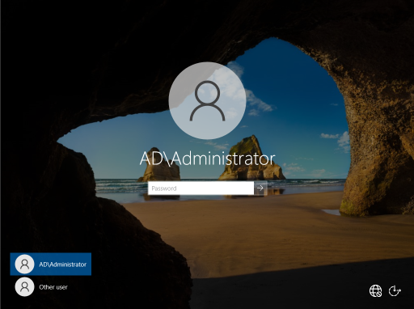
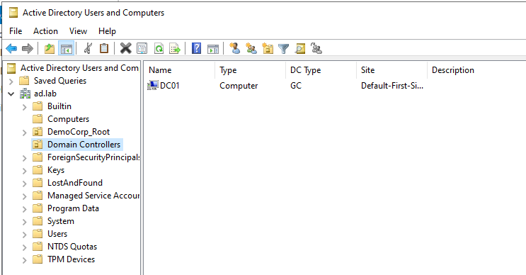

## 1. Prerequisites for Installing New Active Directory Forest
  ### Set Static IP Address
  1.  Run `ipconfig` to get VM configurations and note your **IPv4 Address**, **Subnet Mask**, and **Default Gateway**.
      *   *(You will use these to fill out the following section).*
  2.  Go to **Control Panel** > **Network & Internet** > **Network and Sharing Center** > **Change adapter settings**.
  3.  Right-click the adapter > **Properties** > Click **Internet Protocol Version 4 (TCP/IP)** and select **Properties**.
  4.  Click **Use the following IP address**:
      *   **IP address:** `192.168.242.10` *(You can set as your desired static IP)*.
      *   **Subnet mask:** `255.255.255.0`
      *   **Default gateway:** `192.168.242.2` *(Make sure this matches the gateway found in the ipconfig check earlier)*.
  5.  Click **Use the following DNS server addresses**:
      *   **Preferred DNS server:** `127.0.0.1` *(You can also use the Server IP address for this, but loopback is typically preferred because will still work if the static IP changes)*.
    
  

  
  ### Name the Server
  1.  Go to **System** > **About** > **Rename this PC**.
  2.  Set it to: `DC01`

## 2. Install Active Directory
1.  Open **Server Manager**.
2.  Click **Manage** and click **Add Roles and Features**.
3.  Click **Role-based installation**.
4.  Click **Next** until you reach **Server Roles**.
5.  Select **Active Directory Domain Services** > click **Add Features**.
6.  Click **Next** through the rest of the wizard and click **Install**.

## 3. Promote Server to Domain Controller
1.  In **Server Manager**, click the **Yellow Flag** icon > click **Promote this server to domain controller**.
2.  **Deployment Configuration:**
    *   Select: **Add a new forest**.
    *   **Root domain name:** `ad.lab`
3.  **Domain Controller Options:**
    *   **Forest/Domain Functional Level:** Windows Server 2016.
    *   **Capabilities:** Check **Domain Name System (DNS) server** and **Global Catalog**.
    *   Set a **Directory Services Restore Mode (DSRM)** password.
4.  **DNS Options:**
    *   *Note: You can safely ignore the warning "A delegation for this DNS server cannot be created." This is normal for a new root domain.*
5.  **NetBIOS domain name:**
    *   This should autopopulate (in my case `AD`). You can leave as default.
6.  Click through the remaining screens.
7.  **Prerequisites Check:** You should see a green checkmark at the top.
8.  Click **Install**.
9.  The server will automatically **Reboot**.

## 4. Post Promotion Checks
**Login Verification:**
Your log in name should have changed to your domain account (In my case `AD\Administrator`).



### Verify DNS
Open Command Prompt and run the following command:
```cmd
nslookup ad.lab
```


> **✅ Success Criteria:**
> It should return the IP address of your server (`192.168.242.10`).
> *If it says "Non-existent domain," DNS is broken.*

### Verify AD Services
1.  Open **Server Manager** > **Tools** > **Active Directory Users and Computers**.
2.  Ensure your domain `ad.lab` is visible.
3.  Browse the **Domain Controllers** OU.



> **✅ Success Criteria:**
> You should see `DC01` listed inside the Domain Controllers OU.
