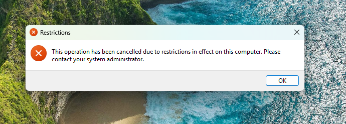

## 1. Test AUP Banner (Computer Policy)

1. Restart the **Windows 11 client VM**.
2. Before you type a password, you should see the pop-up: *"Security Warning: This system is for authorized use only.  Users must obey the Acceptable Use Policy"*.

3. Click **OK**.

> **✅ Success Criteria:**
> You should see the pop-up: "Security Warning: This system is for authorized use only".

## 2. Test Control Panel Lockout (User Policy)

1. Log in as: `jhr` (The Restricted User).
2. Once logged in, right-click the **Start Button** and try to open **Settings** or search for **Control Panel**.

> **✅ Success Criteria:**
> It should show a message: "This operation has been cancelled due to restrictions in effect on this computer."

## 3. Test Admin Privileges (Control Check)

1. Sign out of `jhr`.
2. Sign in as `jadmin`.
3. Try to open **Settings** or **Control Panel**.

> **✅ Success Criteria:**
> It opens normally (because the policy was only applied to the **General_Staff** OU, not the **Admin_Staff** OU).
