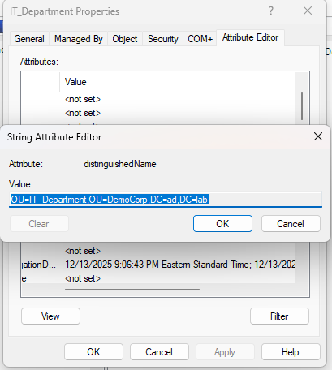
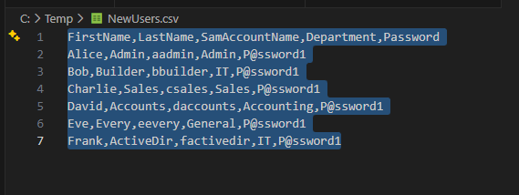
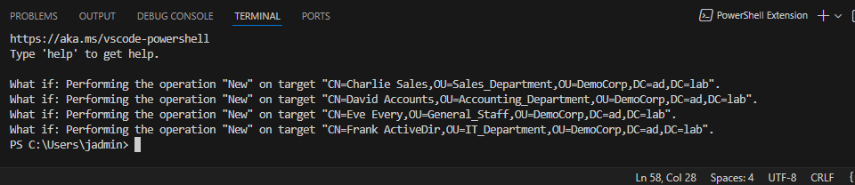

# Lab: Automate User Onboarding with PowerShell

**Goal:** Automate the onboarding process for new employees by bulk-importing users from a CSV file into Active Directory.

**Purpose:**
*   **Scalability:** Whether onboarding 5 users or 100 users the script remains the same.
*   **Standardization:** Ensures every user account is created with the same attributes.

**Execution Notes:**
*   **Remote Execution:** The script is run from **Client-01** using the PowerShell module in RSAT.
*   **Department Sorting:** The script uses `Switch` logic (somewhat similar to an IF/Else in Python) to assess each user's 'Department' attribute and place them in the correct OU.

**Notes on the Script:**
The script mostly exists to reshape the CSV data, especially **Department**, into **Distinguished Names** and other formats that `New-ADUser` strictly requires.

***

## 1. Preparation (Client Machine)

1.  **Create New OUs**
    *   Open **AD Users and Computers**.
    *   Right-click **DemoCorp > New > Organization Unit**.
    *   Create three new OUs (names need to be exact to match the script):
        *   `Sales_Department`
        *   `IT_Department`
        *   `Accounting_Department`

2.  **Discover your OU Paths (Distinguished Names)**
    *   You need the exact **Distinguished Name (DN)** of your target OUs to tell the script where to put users.
    *   Open **AD Users and Computers** > Click **View** > **Advanced features**.
    *   Right-click the **IT_Department** OU > **Properties** > **Attribute Editor** tab > find `distinguishedName`.
    *   Copy at least one for later (e.g., `OU=IT_Department,OU=DemoCorp,DC=ad,DC=lab`).

3.  **Create a CSV File**
    *   Open **Notepad**.
    *   Create headers: `FirstName, LastName, SamAccountName, Department, Password`.
    *   Add 5-10 dummy users (Make sure every department has a user and you can use job titles to help with names).
    *   Save the file as `C:\Temp\NewUsers.csv` on the client machine.

***

## 2. The Script

1.  I have included the script in the script folder and there is annotation on the script.
2.  **Things that stand out:**
    *   **Distinguished Names (DN)** which are required by the `New-ADUser` cmdlet.
    *   Use of a **Switch** to sort the CSV Department attribute into the required DN format.
    *   **UserPrincipalName (UPN)** which is a unique identifier formatted like an email. It is used to sign into AD-joined computers but also Microsoft 365/Entra ID.

***

## 3. Verification

1.  **Dry Run**
    *   Add `-WhatIf` to the end of the `New-ADUser` object in the script.
    *   In **VS Code** press the **play button**.
    *   You should see text for every user in your CSV file. If you don't, you will need to troubleshoot the error messages you encounter.

2.  **Live Run**
    *   Once your dry run comes back clean, remove the `-WhatIf`.
    *   Press the **play button** (you likely won't see more output).

3.  **Verification Steps**
    *   Open **Active Directory Users and Computers**.
    *   Right-click the **DemoCorp** folder and select **Refresh**.
    *   Click into `IT_Department`.
    *   Click into `Accounting_Department`.

    | ✅ **Success Criteria:** You should see **Bob** and **Frank** in the `IT_Department` and **David** in the `Accounting_Department`.
