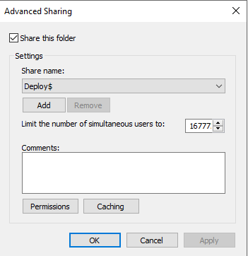
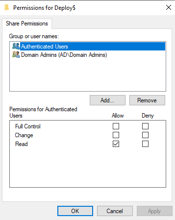
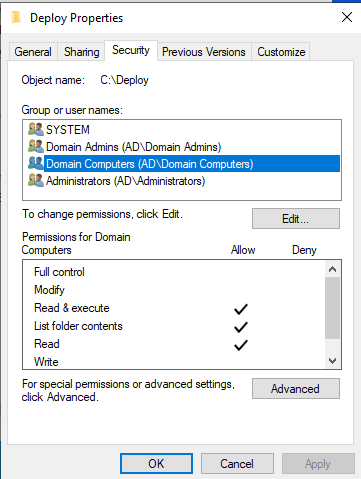
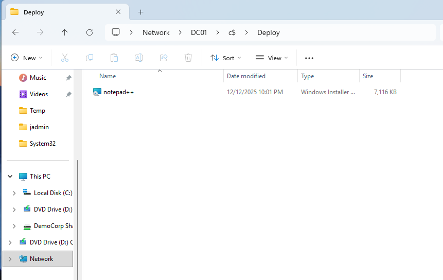
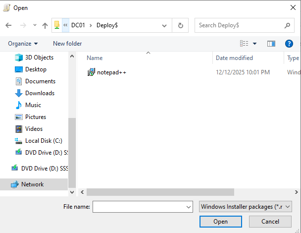
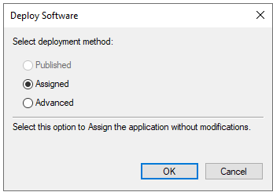
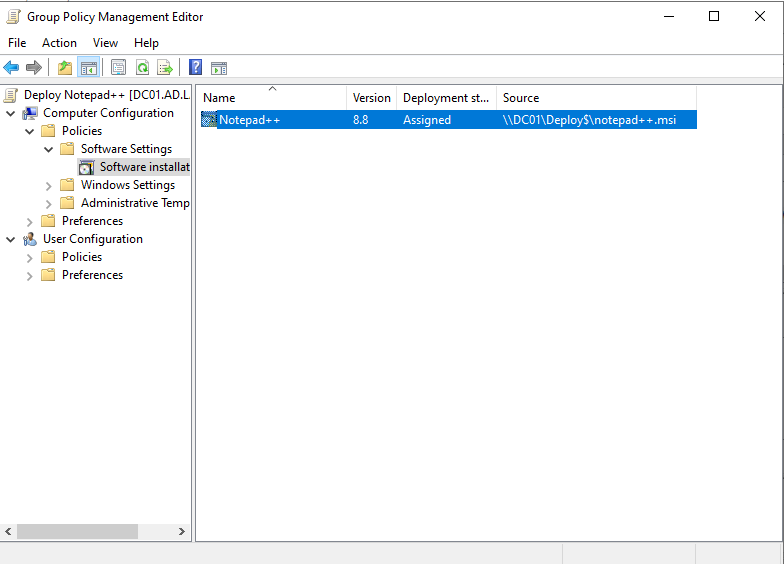

# Lab: Software Deployment (Notepad++)

**Goal:** Automate the deployment of standard business software (i.e., Notepad++) to workstations using Group Policy Objects (GPOs).

**Deployment Model:** Computer-based assignment
*   Computer-based assignment is standard for software that should be on every computer. (There are times where User-based software deployment makes sense, i.e., if it's department-specific software).

**Security Mode:**
*   **Hidden Share (Deploy$):** The installer sits in a hidden network share; this is mostly done to prevent accidental changes or user browsing confusion.
*   **Computer-based Permissions:** Unlike standard file shares where Users need access, this software deployment requires **Domain Computers** to have Read & Execute NTFS permissions.
    *   The installation happens at boot, before users sign on; so the computer must authenticate itself to the server.

> **Note:** GPO Software Installation works best with MSI packages; there are often limitations with EXE-based installers. (EXE files are often deployed with a startup script or the more modern way using Intune).

---

### 1. Create the 'Deploy$' Share on DC (Server)

1. Create the folder:
    *   On the server (C: drive), create a new folder named `Deploy`.
2. Share Permissions (Network Access):
    *   Right-click **Deploy** > **Properties** > **Sharing** > **Advanced Sharing**.
    *   Check **Share this folder**.
    *   **Share Name:** Change to `Deploy$` (the $ makes it hidden).
  

    *   Click **Permissions**. Remove **Everyone**. Add `Authenticated Users` (Read). Click **OK**.
  

3. NTFS Permissions (Domain Computer permissions):
    *   Click the **Security** tab.
    *   Click **Edit** > **Add**.
    *   Type `Domain Computers` > **Check Names** > Select **Domain Computers** > **OK**.
    *   Ensure **Domain Computers** has **Read & Execute** allowed > Click **OK** > **Close**.

| ✅ **Success Criteria:** The folder is shared as `Deploy$` and `Domain Computers` have Read & Execute NTFS permissions.

---

### 2. Download on Client: Notepad++ MSI

1. Go to the official Notepad++ Downloads page > Select latest release > Download the 64-bit installer.
2. Make sure to click the **MSI - Installer**.
3. On the Client: Open **File Explorer** and type into the top address bar:
    *   `\\DC01\c$`
4. This will open the C: folder on the Server. Open the `Deploy` folder you just created.
5. Drag and drop the MSI file from the Client's downloads folder to the `Deploy` folder.
6. Rename the file `notepad++` (this will help with file referencing later).

---

### 3. Configure 'Status' GPOs (Optional)

**A. Force Verbose Status:**
1. **Computer Configuration** > **Policies** > **Administrative Templates** > **System**.
2. Double-click **Display highly detailed status messages**.
3. Click to set to **Enabled**. Click **OK**.

**B. Force Network Wait:**
1. **Computer Configuration** > **Policies** > **Admin Templates** > **System** > **Logon**.
2. Double-click **Always wait for the network at computer startup and logon**.
3. Click to set to **Enabled**. Click **OK**.

---

### 4. Configure the GPO (Perform on Client via RSAT)

1. Open **Group Policy Management**.
2. Right-click **Workstations OU** > **Create a GPO in this domain, and Link it here...**
3. Name it: `Deploy Notepad++`.

---

### 5. Add the Software Installation to the GPO

1. Right-click the new GPO > **Edit**.
2. **Computer Configuration** > **Policies** > **Software Settings** > **Software installation**.
3. Right-click the empty space > **New** > **Package**.
4. In the file browser bar, type the UNC path:
    *   `\\DC01\Deploy$\notepad++.msi`

5. Click **Open**.
6. Select **Assigned**. Click **OK**.

7. **Verify:** The **Source** column displays the UNC path.

---

### 6. Deployment

1. On the Client, open **Command Prompt** as **Administrator**.
2. Run `gpupdate /force`.
3. It will ask to restart: Type `Y` and press **Enter**.
4. **Moment of Truth:**
    *   Watch the screen while it boots.
    *   Because of the **Force Verbose Status**, you should see "Installing managed software Notepad++..."

---

### 7. Success Check

1. Log in > Look for the **Notepad++** icon on the desktop or in the **Start Menu**.
2. You have successfully remotely deployed software to a computer.

| ✅ **Success Criteria:** Notepad++ appears in the Start Menu and opens normally without user-initiated installation.
