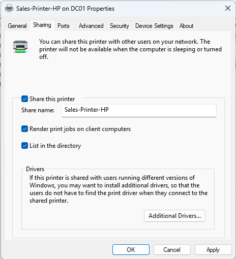
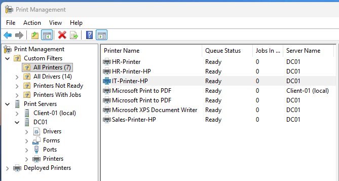

# **Goal: Centralize print management on the Server (`DC01`) and automate printer mapping for end-users based on their Department/Security Group**

### **Deployment Strategy: Group Policy with Item-Level Targeting**
*   Instead of creating a separate GPO for every department (which creates 'GPO Bloat'), we use a single GPO with Item-Level Targeting based on Security Groups.
*   This allows the GPO to evaluate "Is this user in HR?" before mapping the printer.
*   **Result:** Users only see the printers relevant to their job function (Security Group).

### **Purpose:**
*   In a production environment, manually installing printers on individual workstations is inefficient.
*   This setup achieves **"Zero-Touch Provisioning"**: An HR employee simply logs in, and the correct print drivers and settings are automatically configured.

---

## **1. Install the Print Server Role (On the Server)**

1.  Open **Server Manager** > **Manage** > **Add Roles and Features**.
2.  Click through the wizard, making sure `DC01` is selected.
3.  At **Server Roles**, select **Print and Document Services**.
4.  Click through the wizard. At **Role Services**, make sure **Print Server** is selected.
5.  Click **Install**.

---

## **2. Driver Setup and Printer Creation (On the Client)**

### **Step 1 - Add DC01 to Print Management**
1.  Open **Print Management** (`printmanagement.msc`).
2.  Right-click **Print Servers** > **Add/Remove Servers**.
3.  In **Add Servers**, type `DC01` > Click **Add to List**.

### **Step 2 - Create a Fake Port**
1.  Expand `DC01` > Right-click **Ports** > **Add Port...**.
2.  Select **Standard TCP/IP Port** > **New Port...** > **Next**.
3.  **Printer Name or IP Address:** Pick an address not in use from your subnet.
    *   Ex: If the Server is `192.168.242.10`, make the printer `192.168.242.100`.
4.  It will try to detect the device and fail. Wait a few seconds.
5.  When it finishes, choose **Custom** > **Next** > **Finish**.

### **Step 3 - Install a "Real" Driver**
1.  Search for **HP Universal Print Driver (PCL6)** and download the driver from the HP website.
2.  Extract the folder and look for a `.inf` file. Look for:
    *   Prefix: `hpcu` (HP Core Universal)
    *   Ending: `u` (Universal)
    *   Example: `hpcu345u.inf`
3.  Right-click **Drivers** > **Add Driver**.
4.  Click through until you see **Printer Driver Selection** and select **Have Disk**.

### **Step 4 - Create the Printer**
1.  Expand `DC01` > Right-click **Printers** > **Add Printer**.
2.  Select **Add a new printer using an existing port**:
    *   Select the IP Port you created earlier (`192.168.242.100`).
3.  Select **Use an existing printer driver on the computer**:
    *   Select **HP Universal Printing PCL 6**.
4.  **Driver:** Install a new driver > **Manufacturer:** Generic > **Generic/Text Only**.
5.  **Naming:**
    *   **Printer Name:** `Sales-Printer-HP`
    *   **Share Name:** `Sales-Printer-HP`
    *   Check **Share this printer**.
6.  After installation:
    *   Right-click the printer > **Properties** > **Sharing** > Click **List in the directory**.
  

---

## **3. Create the GPO with Item-Level Targeting**

### **Step 1: Create the GPO**
1.  Open **Group Policy Management**.
2.  Right-click the `DemoCorp` OU > Click **Create a GPO in this domain, and Link it here...**.
3.  Name the GPO: `U_MapPrinter`.
    *   *Note: We link to DemoCorp because users are in multiple OUs. Targeting will filter access to the right users.*

### **Step 2: Create Sales Staff Security Group**
1.  Right-click the **Groups** folder > **New** > **Group**.
2.  **Group Name:** `G_Sales_Staff`.
3.  Leave default **Group Scope: Global** / **Group Type: Security**.
4.  Right-click `G_Sales_Staff` > **Properties** > **Members**.
5.  Click **Add** > Search for `Charlie Sales`.

### **Step 3: Set up the Printer Mapping**
1.  Right-click the GPO > **Edit**.
2.  Navigate to **User Configuration** > **Preferences** > **Control Panel Settings** > **Printers**.
3.  Right-click the white space > **New** > **Shared Printer**.
4.  **General Tab:**
    *   **Action:** Update
    *   **Share path:** `\\DC01\Sales-Printer-HP`
5.  **Common Tab:**
    *   Check **Run on logged-in user's security context**.
    *   Check **Item-level targeting** > Click **Targeting**.
    *   Click **New Item** > **Security Group**.
    *   Click **...** > Search for `G_Sales_Staff` > Click **OK**.
    *   It should read: *"the user is a member of the security group AD\G_Sales_Staff"*.

---

## **4. Verification**

### **Test 1: Sales User (Positive)**
1.  Log in as `Charlie Sales`.
2.  Navigate to **System** > **Bluetooth & Devices** > **Printers & Scanners**.
| ✅ | **Success Criteria:** `Sales-Printer-HP` should be listed. |
| :--- | :--- |

### **Test 2: IT Staff User (Negative)**
1.  Log in as `Bob Builder`.
2.  Navigate to **System** > **Bluetooth & Devices** > **Printers & Scanners**.
| ✅ | **Success Criteria:** `Sales-Printer-HP` should be absent. |
| :--- | :--- |
