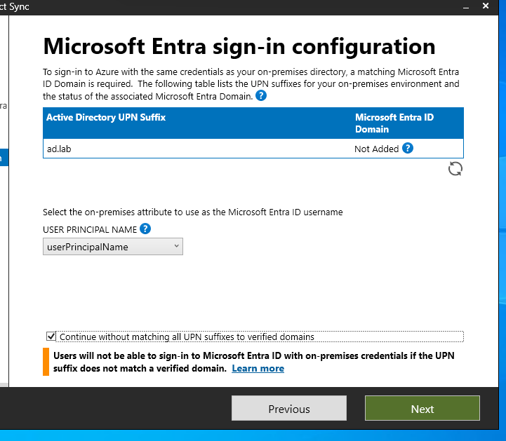
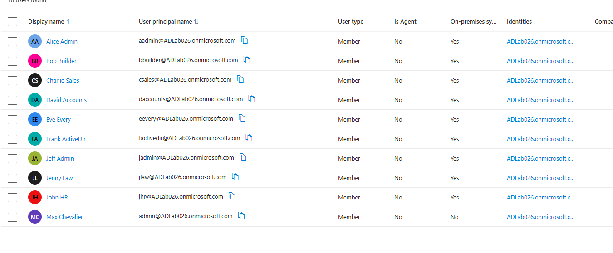

# **Establish a Hybrid Identity**
**Goal:** Synchronize on-premises Active Directory Users and Groups to Microsoft Entra ID. This enables a modern Single Sign-On (SSO) experience, where users are able to access cloud resources (Office 365, Teams, OneDrive, etc.) with their existing on-premises credentials.

---

### **Architecture Strategy: Dedicated AADC Server (Tier 0 isolation)**
*   Instead of installing Microsoft Entra Connect directly on the Domain Controller (which increases the attack surface), we deployed a dedicated Member Server (`AADC-01`).
*   This adheres to the principle of **Least Privilege** by keeping the Domain Controller directly untouched and locked down.

### **Security Setup: Hardened Installation**
*   **IE Enhanced Security Configuration:** We did not disable server security globally.
*   Instead, specific Microsoft endpoints were allow-listed to allow synchronization and authentication while keeping the server secure.
*   I found a list of 10 suggested URLs to allow-list, but during the actual setup, the installer prompted for approximately 7 additional URLs.

### **Administrative Install**
*   Used **RDP** on the `Client-01` VM with a `jadmin` account to install and configure Azure AD Connect / Entra Connect.

### **Authentication Method: Password Hash Synchronization (PHS) with SSO**
*   The recommended Microsoft Entra ID hybrid sign-in method. Actual passwords are never sent to the cloud; a hash of the password is synchronized.

### **Clean Sync**
*   Only the user/group populated `DemoCorp` Organizational Unit (OU) is synced, keeping the cloud environment clean and secure.

---

## **1. Cloud Setup**
*You need to have a Microsoft 365 tenant, acting as a private instance of Microsoft Entra ID, to sync/manage users.*

1. **Get the Tenant:**
    - Search for "Microsoft 365 Business Premium **Free Trial**."
    - Sign up for a free 30-day trial (requires a credit card for verification).

## **2. Prepare the Domain Controller**
*(Ensure your Domain Controller is running and the `DemoCorp` OU is populated with the desired users and groups).*

## **3. Build the Member Server**
*Perform these steps in VMware.*

1.  **File > New Virtual Machine > Install Windows Server 2022.**
2.  **Configuration Type:** Select **Typical** (recommended).
3.  **Guest Operating System Installation:** Select **I will install the operating system later.**
4.  **Select a Guest Operating System:** Select **Microsoft Windows** and **Windows Server 2022.**
5.  **Virtual Machine Name:** `AADC-01`
6.  **Specify Disk Capacity:**
    - Maximum disk size: `60 GB`.
    - Select **Split virtual disk into multiple files.**
7.  **Hardware Customization:**
    - Memory: `2048 MB`.
    - CPU: `2 cores`.
8.  **Mount ISO:** Click on the new VM > **Edit Virtual Machine Settings.**
    - Select **CD/DVD (SATA).**
    - Select **Use ISO image file** > Browse and select your Windows Server 2022 ISO.

## **4. Configure Networking and Join the Domain**
*Perform this on the new `AADC-01` Server.*

1.  **Networking:**
    - Press `Win + R` > type `ncpa.cpl`.
    - Right-click adapter > **Properties** > **Internet Protocol Version 4 (TCP/IPv4)** > **Properties.**
    - **IP address:** `192.168.242.11`
    - **Subnet mask:** `255.255.255.0`
    - **Default gateway:** `192.168.242.2`
    - **Preferred DNS server:** `192.168.242.10`
2.  **Join the Domain:**
    - Open **Server Manager** > **Local Server.**
    - Click the **Workgroup** name > **Change.**
    - **Computer Name:** `AADC-01`.
    - **Member of Domain:** `ad.lab` (Enter Domain Admin credentials when prompted).
    - **Restart** the server and log in with your **Domain Admin** account.

## **5. Enable RDP on the Destination (AADC-01)**

1.  In **Server Manager**, click **Local Server.**
2.  Click **Disabled** next to **Remote Desktop.**
3.  Select **Allow remote connections to this computer.**
4.  (Optional) Uncheck "Allow connections only from computers running Remote Desktop with Network Level Authentication" for laboratory purposes.
5.  Click **OK.**

## **6. Download AzureADConnect.msi**

1.  Navigate to the **Microsoft Entra Admin Center.**
2.  Go to **Entra Connect** > **Connect Sync** > **Download Connect Sync Agent.**

## **7. Client RDP to AADC-01**
*Perform on `Client-01` VM using the `jadmin` user.*

1.  Press `Win + R` > type `mstsc`.
2.  **Computer:** `192.168.242.11` (**Do not connect yet**).
3.  Click **Show Options** > **Local Resources** tab.
4.  Under **Local devices and resources**, click **More...**
5.  Check the box for **Drive C:** > Click **OK.**
6.  Click **Connect** and enter your Admin credentials.

## **8. RDP File Transfer and Setup**

1.  Inside the RDP window for `AADC-01`, open **File Explorer.**
2.  Go to **This PC** > Select **C on Client-01.**
3.  Navigate to `Users\jadmin\Downloads`.
4.  Drag and drop `AzureADConnect.msi` onto the `AADC-01` desktop.

## **9. Configure Trusted Sites**

1.  Press `Win + R` > type `inetcpl.cpl`.
2.  Go to **Security** tab > **Trusted sites** > **Sites.**
3.  Add the following Microsoft/Azure URLs to the allow-list:
    - `https://login.microsoft.com`
    - `https://login.microsoftonline.com`
    - `https://login.live.com`
    - `*.aadcdn.msftauth.net`
    - `*.msauth.net`

## **10. Install and Configure Entra Connect**
*Performed via RDP on `Client-01`.*

1.  Run the `AzureADConnect.msi` installer.
2.  Select **Customize** > **Install.**
3.  **User Sign-in:** Select **Password Hash Synchronization** and **Enable Single Sign-On.**
4.  **Connect to Microsoft Entra ID:** Log in with your Global Admin account (`admin@YOURTENANT.onmicrosoft.com`).
5.  **Connect Your Directories:**
    - Select forest: `ad.lab`.
    - Click **Add Directory** > **Create new AD account** > Enter `ad.lab\Administrator` credentials.
6.  **Entra Sign-in Configuration:** Check **"Continue without matching all UPN suffixes to verified domains."**

7.  **OU Filtering:**
    - Select **Sync selected domains and OUs.**
    - Uncheck `ad.lab` and check **only** the `DemoCorp` OU.
8.  Click **Next** and **Install.** Enter Domain Admin credentials for SSO setup when prompted.

| ✅ **Success Criteria:** The installer should complete successfully, and users from the `DemoCorp` OU should begin appearing in the Microsoft Entra Admin Center. |
| :--- |
