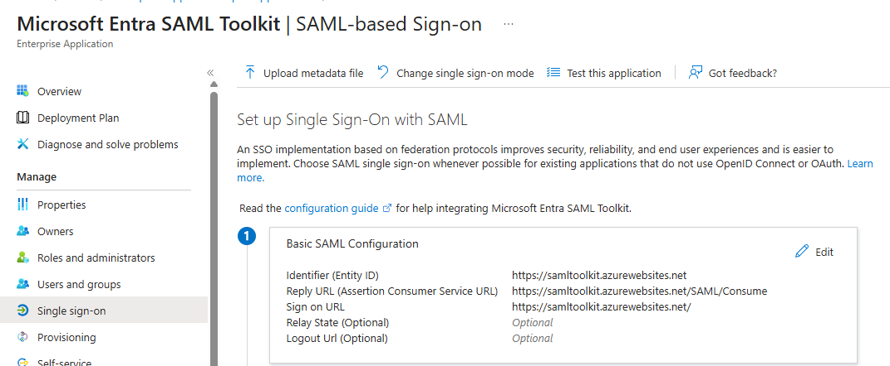
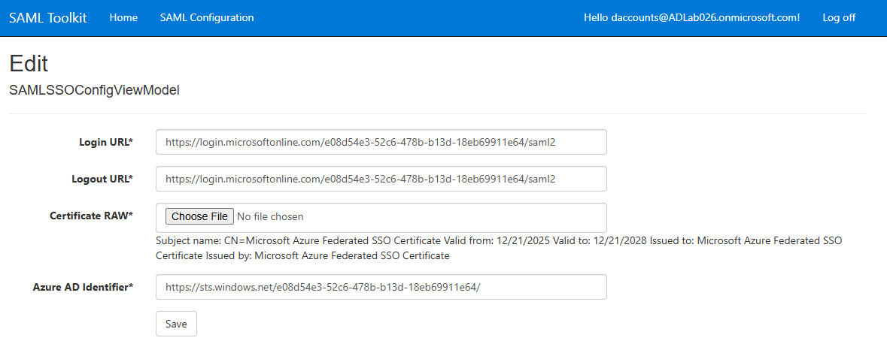
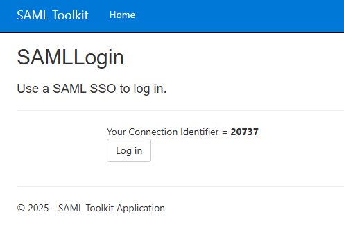
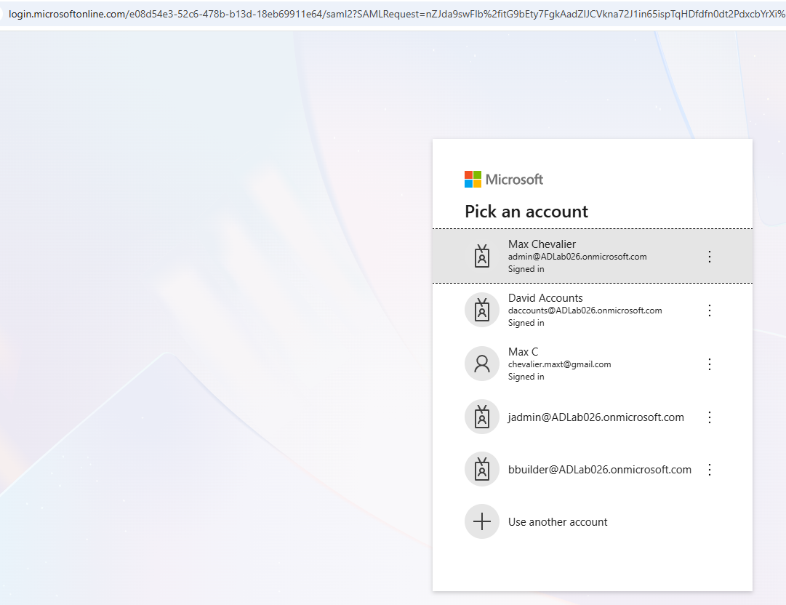

### **Lab: Federating a SaaS Application with Microsoft Entra ID (SAML 2.0)**

**Goal:** Centralize identity management and enable Single Sign-On by federating a third-party SaaS application (**SAML Toolkit**) with **Microsoft Entra ID** using SAML 2.0.

---

**Deployment Strategy:**
1.  **Federated Identity Bridge:** Establish a trust relationship between the Identity Provider (Entra ID) and the Service Provider (SAML Toolkit). This eliminates the need for separate service credentials.
2.  **Certificate-based Security:** Authentication is secured via Base64 RAW certificate. This ensures that the SaaS application only accepts tokens signed by the corporate directory.
3.  **Least Privilege Assignment:** Only specific identities (i.e., `David Accounts`) are assigned to the application.

**Purpose:**
1.  **Identity Consolidation:** By using SSO, we eliminate "password fatigue" and the risk of weak password reuse across multiple services.
2.  **Centralized Lifecycle Management:** Provides centralized access control; disabling a user in Entra ID disables their access to all integrated SaaS applications (Salesforce, Slack, etc.).

---

### **1. Provision the SaaS Application**

1.  In **Microsoft Entra Admin Center**, go to **Entra ID** > **Enterprise Applications** > select **+ New Application**.
2.  Search for **Microsoft Entra SAML Toolkit**.
3.  Click **Create**.
4.  Click into the App > **Assign Users and Groups** > **Add User/Group** > Click **None Selected** under **Users and Groups**.
5.  Add your User (i.e., `David Accounts`).

| ✅ **Success Criteria:** The application should appear in your Enterprise Applications list with the user assigned.

---

### **2. Configure the Identity Provider (IdP) - Microsoft Entra ID**

*Guide: [SAML Toolkit Tutorial](https://learn.microsoft.com/en-us/entra/identity/saas-apps/saml-toolkit-tutorial)*

1.  Select **Single Sign-On** > **SAML**.
2.  Edit **Basic SAML Configuration** (Section 1):
    *   **Identifier (Entity ID):** `https://samltoolkit.azurewebsites.net` (This should already be filled in).
    *   **Reply URL:** `https://samltoolkit.azurewebsites.net/SAML/Consume`
    *   **Sign on URL:** `https://samltoolkit.azurewebsites.net/`
3.  **SAML Certificates** (Section 3): Download the **Certificate (Raw)** into your downloads folder.
4.  **SAML Toolkit** (Section 4): Keep this tab open; you will need this info for the next part.

---

### **3. Configure the Service Provider (SaaS App)**

*Most SAML apps require you to help provision by entering Cloud/Microsoft details into their admin portals.*

1.  Go to [https://samltoolkit.azurewebsites.net/](https://samltoolkit.azurewebsites.net/)
2.  **Register User:** Click **Register** and create an account with the email address of a synced Entra ID user (i.e., `daccounts@ADLab026.onmicrosoft.com`).
3.  **The Handshake:** Click **SAML Configuration** in the top menu > Click **Create**.
    *   **Login URL:** `https://login.microsoftonline.com/e08d54e3-52c6-478b-b13d-18eb69911e64/saml2`
    *   **Azure AD Identifier:** `https://sts.windows.net/e08d54e3-52c6-478b-b13d-18eb69911e64/`
    *   **Logout URL:** `https://login.microsoftonline.com/e08d54e3-52c6-478b-b13d-18eb69911e64/saml2`
    *   **Certificate RAW:** Choose File > **Microsoft Entra SAML Toolkit.cer** (saved earlier).
    *   Click **Create**.

---

### **4. Verification**

1.  **The "Magic" Link:** After clicking **Create** on SAML 2.0 Single sign-on Configuration, the field below will be populated:
    *   **SP Initiated Login URL:** `https://samltoolkit.azurewebsites.net/SAML/Login/20737`

2.  **Demo:**
    *   Paste the URL into a **Private/Incognito** browser.
    *   You should be taken to a website that says: "Use a SAML SSO to log in" > then displays **Your Connection Identifier** = `20737`.
    *   You will be asked to log in to your Entra ID account. Use your synced Entra ID user (i.e., `daccounts@ADLab026.onmicrosoft.com`).

| ✅ **Success Criteria:** You are redirected back to the app and logged in automatically without entering the website-specific username and password created in Part 3.
