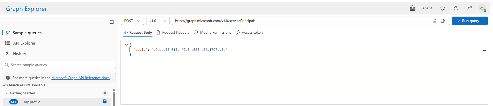
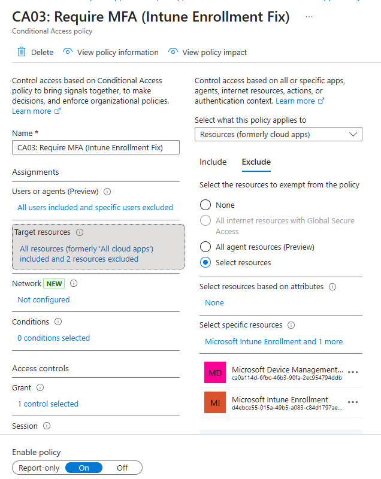

# **1. Objective: Deploy Hybrid Azure AD Join & Intune Enrollment**

**Objective:** Deploy Windows Hybrid Azure AD Join and Intune Auto-Enrollment w/ GPO in an environment enforcing "Strict MFA for All Users."

**Challenge:** The enrollment process fails silently. While devices successfully register with Entra ID, the MDM (Intune) connection gets lost in silent MFA requests.

**Solution:** Implement a Zero Trust architecture using Conditional Access exclusions. This allows non-interactive system processes to authenticate via internal verifications while maintaining strict MFA for user sessions.
*   *Note: This problem was "solved" in Lab 13 by using Office Location IP exemptions, but this will not work for remote workers.*

**Root Cause:**
1. The GPO was programmed with the **'User Credential'** enrollment method.
2. The Conditional Access policy enforced **'MFA for All Resources'**; Entra ID challenged silent enrollment requests.

---

# **2. Architecture Decision: Strategy Selection**

**Strategy One: Switch to Device Credentials** (Often used in very large Orgs) — **REJECTED**
*   **Method:** Change GPO to enroll using the Computer Object.
*   **Pro:** Bypasses User MFA entirely.
*   **Con:** Loss of primary user which **causes** Intune to classify it as a "Shared Device." Loss of Zero Trust Checks: Conditional Access policies requiring "Compliant Devices" fail without an attached User.

**Strategy Two: Granular Conditional Access Exclusion** — **SELECTED**
*   **Method:** Keep User Credentials but whitelist specific Enrollment Resources.
*   **Pro:** Preserves "Strict MFA" for all apps; adheres to Zero Trust principles.
*   **Con:** Robust configuration is required as there is missing native support.

---

# **3. Implementation: Exposing Resources & Configuring CA03**

**Part 1: Exposing "Hidden" Resources**
Microsoft Intune Enrollment is not **visible** in the Entra Conditional Access picker. You must utilize Microsoft Graph to instantiate the Service **Principal** manually.

1. Go to: `https://developer.microsoft.com/en-us/graph/graph-explorer`
2. Set `POST` to `https://graph.microsoft.com/v1.0/servicePrincipals`
3. Enter the following JSON body to expose the Intune **Enrollment** ID for Resource selection:
`{ "appId": "d4ebce55-015a-49b5-a083-c84d1797ae8c" }`

**Part 2: Configure CA03: Require MFA (Strict + Intune Enrollment Exclusion)**

1. Navigate to **Entra ID** > **Conditional Access** > **Policies**.
2. Turn **Off** all other policies.
3. Click **+ New Policy**:
    *   **Policy Name:** `CA03: Require MFA (Strict + Intune Enrollment Exclusion)`
    *   **Users:** All Users (Exclude Break Glass Admin).
    *   **Target Resources:**
        *   **Include:** All Resources.
        *   **Exclude:** 
            *   `Microsoft Intune Enrollment` (ID: `d4ebce55-015a-49b5-a083-c84d1797ae8c`)
            *   `Microsoft Device Management` (ID: `ca0a114d-6fbc-46b3-90fa-2ec954794ddb`)
    *   **Access Controls:** Grant Access > **Require Multifactor Authentication**.

> **Technical Note:** I discovered that excluding only the Enrollment resource (`d4eb...`) failed with a "Credentials not verified" error. I identified via Sign-in Logs that the background sync process utilizes a secondary ID (Microsoft Device Management - `ca0a...`). Adding this second exclusion resolved the sync failure.

---

# **4. Validation and Success Criteria**

**Step 1: Client-Side Verification**
1. On the client machine, go to **Settings** > **Accounts** > **Access Work or school**.
2. Click on the account; the **Info** button should appear.
3. Click **Info** > Click the **Sync** button.

| ✅ **Success Criteria:** The sync should work successfully, syncing settings and apps with Microsoft Intune without an MFA prompt. |
| :--- |

**Step 2: Zero-Trust Verification**
1. **Non-Interactive:** Confirm background syncs and app installs occur without user intervention.
2. **Interactive:** Attempt to log in to a web resource; verify MFA is still enforced for all user logins.

| ✅ **Success Criteria:** MFA remains "Strict" for user sessions while allowing silent background MDM processes. |
| :--- |

**Step 3: Intune Management GUI**
1. Open the **Intune Admin Center**.
2. Check the **Devices** list.

| ✅ **Success Criteria:** Device visibility: `Client-01` should appear in the Intune Admin Center as a Managed device. |
| :--- |
