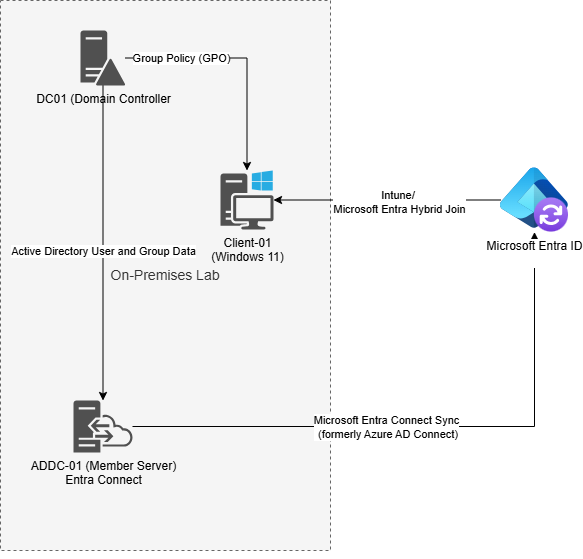

Hybrid Active Directory & Cloud Management Lab

Phase 1 - Foundations (Sections 1-6):  
  - Virtualization:  Started by initially setting up a Windows Server 2022 then a Windows 11 client on VMWare Workstation Pro
  - Active Directory: Promoted the Windows Server 2022 to a Domain Controller, and organized the environment using OUs, Groups and Users
  - Group Policy Objects (GPOs):  Configured two baseline GPOs (Acceeptable User Policy banner and Control Panel lockout) and, after connecting a client to the domain, verified the policies were correctly being applied
    
Phase 2 - On-Premise Administration (Sections 7-11):
  - Infrastructure Provisioning:  Implemented Folder Shares (mapped drive) and a Print Server via GPO
  - Security: Set up RSAT for Server security
  - Automation (User Creation): Deployed a Powershell script for bulk user creation in AD 
  - Automation (Software Deployment): Installed business software on client machines using GPOs

Phase 3 - Hybrid & Cloud Identity (Section 12-13.5):
  - Secure Hybrid Setup: Maintained IE Enhanced Security Configuration, built domain-joined member server and used RDP for sync configuration
  - Entra Connect: Connected the local AD to the cloud using Microsoft Entra Connect creating a Hybrid Identity
  - Two-Identity Problem: Resolved non-matching UPNs by aligning local identities with Entra ID identities so hybrid syncronization and authentication will work
  - Zero-Trust Cloud: Build custom Conditional Access Policies, aligned with Zero-Trust principles, for geolocation based Multi-Factor Authentication (MFA)
  
Phase 4 - Secure Cloud Integration and Modern Endpoint Management (Section 14-16):
  - SSO: Configured modern SaaS application access using SAML Single Single-On (SSO)
  - 

Add an Architecture Diagram: Use a tool like Lucidchart or Draw.io to create a one-page map of your lab.[1][2] Show the VMware network, the DC, the Client VM, and the connection to the Entra ID cloud.[1] Put this in your main README.md.[1][2]

"Challenges & Solutions" Section: In your main README, add a small section called 

"Troubleshooting & Lessons Learned."[1][2] Briefly mention one specific error you hit (e.g., a DNS issue or a sync error) and how you fixed it. Employers love hearing about how you solve problems.
--main issue with on prem was i forgot/didn't to load the msi file before i did the software deployment .  for some reason it wouldn't work if i tried to put it in after
    - just created a new GPO and it worked and I deleted the old one

  cloud problems
  my fault--documented the problems i had with the cloud.  wasn't aware of the two-identity problem so didn't have the local domain matching the entra id upn
  UPN Mismatches: Mention that if a user has a .local UPN on-prem but a .com in the cloud, soft-matching will fail, making your hard-match script the only solution.
  middle--security defaults.  extremely prohibative and have to disable them all to get exceptions
  bad setup--that Intune Enrollment app isn't natively supported even thought it seems to be required to maintain MFA and use Intune enrollment - get experience with Microsoft Graph Powershell

===future ideas..direct to cloud powershell...need Microsoft Graph Powershell ...user creation
  - set up sharepoint for cloud shard drive - drive access management
  - - print- tough
    - 

*Resources used to complete this lab include:  YouTube videos, Microsoft articles, Google searches, and Gemini Q&A.  Gemini was used to convert my initial typed writeups into Markdown for presentation and readability.
